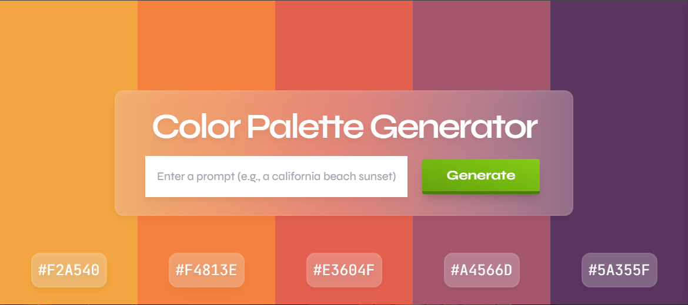

<a name="readme-top"></a>

<!-- PROJECT LOGO -->
<br />
<div align="center">
  <h1 align="center">Color Palette Generator</h1>

  <p align="center">
    Generate color palettes using GPT 3.5
  </p>
</div>



<!-- TABLE OF CONTENTS -->
<details>
  <summary>Table of Contents</summary>
  <ol>
    <li>
      <a href="#about-the-project">About The Project</a>
      <ul>
        <li><a href="#built-with">Built With</a></li>
      </ul>
    </li>
    <li>
      <a href="#getting-started">Getting Started</a>
      <ul>
        <li><a href="#prerequisites">Prerequisites</a></li>
        <li><a href="#installation">Installation</a></li>
      </ul>
    </li>
    <li><a href="#license">License</a></li>
    <li><a href="#contact">Contact</a></li>
    <li><a href="#acknowledgments">Acknowledgments</a></li>
  </ol>
</details>

<!-- ABOUT THE PROJECT -->

## About The Project

The Color Palette Generator is a simple web app where you provide a prompt and GPT 3.5 will return five hex colors matching the prompt. Users can click the various color columns to copy the hex code to their clipboard.

<p align="right">(<a href="#readme-top">back to top</a>)</p>

<!-- BUILT WITH -->

### Built With

[![GPT][gpt-shield]][gpt-url]
[![NEXT][next-shield]][next-url]
[![TS][ts-shield]][ts-url]
![HTML][html-shield]
![CSS][css-shield]

<p align="right">(<a href="#readme-top">back to top</a>)</p>

<!-- GETTING STARTED -->

## Getting Started

### Prerequisites

-   Node.js 18.17 or later:
    [https://nodejs.org/](https://nodejs.org/)

### Installation

1. Clone the repo
    ```sh
    git clone https://github.com/cjsidler/color-palette-generator.git
    ```
2. Add a .env file with your OPENAI_API_KEY
3. Run the project
    ```sh
    npm run dev
    ```

<p align="right">(<a href="#readme-top">back to top</a>)</p>

<!-- LICENSE -->

## License

[![MIT License][license-shield]][license-url]

<p align="right">(<a href="#readme-top">back to top</a>)</p>

<!-- CONTACT -->

## Contact

Contact me via email, LinkedIn, or GitHub:

[![Email][gmail-shield]][gmail-url]
[![LinkedIn][linkedin-shield]][linkedin-url]
[![GitHub][github-shield]][github-url]

<p align="right">(<a href="#readme-top">back to top</a>)</p>

<!-- ACKNOWLEDGMENTS -->

## Acknowledgments

-   [README Template](https://github.com/othneildrew/Best-README-Template)
-   [Link Badges](https://shields.io/)

<p align="right">(<a href="#readme-top">back to top</a>)</p>

<!-- MARKDOWN LINKS & IMAGES -->

[gpt-shield]: https://img.shields.io/badge/GPT_3.5-black?style=for-the-badge&logo=openai&logoColor=white
[gpt-url]: https://openai.com/
[next-shield]: https://img.shields.io/badge/Next.js-301934?style=for-the-badge&logo=next.js&logoColor=white
[next-url]: https://nextjs.org/
[license-shield]: https://img.shields.io/github/license/othneildrew/Best-README-Template.svg?style=for-the-badge
[license-url]: https://github.com/othneildrew/Best-README-Template/blob/master/LICENSE.txt
[linkedin-shield]: https://img.shields.io/badge/-LinkedIn-black.svg?style=for-the-badge&logo=linkedin&colorB=555
[linkedin-url]: https://www.linkedin.com/in/collinsidler/
[html-shield]: https://img.shields.io/badge/Html-orange?style=for-the-badge&logo=html5&logoColor=white
[css-shield]: https://img.shields.io/badge/Css-cornflowerblue?style=for-the-badge&logo=css3
[ts-shield]: https://img.shields.io/badge/typescript-blue?style=for-the-badge&logo=typescript&logoColor=white
[ts-url]: https://go.dev
[gmail-shield]: https://img.shields.io/badge/Gmail-D14836?style=for-the-badge&logo=gmail&logoColor=white
[gmail-url]: mailto:cjsidler@gmail.com
[github-shield]: https://img.shields.io/badge/GitHub-black?style=for-the-badge&logo=github&logoColor=white
[github-url]: https://github.com/cjsidler/go-cli-quizzer
